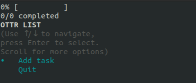
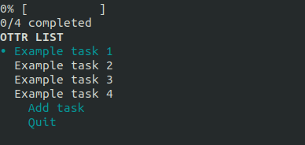
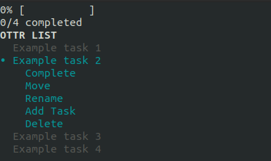
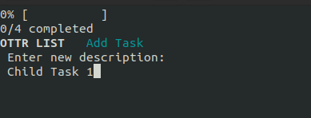
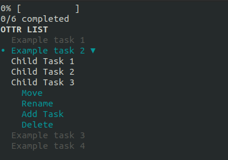
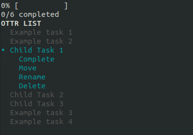
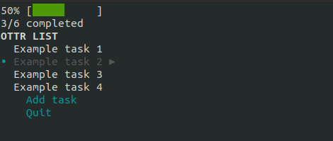
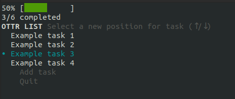
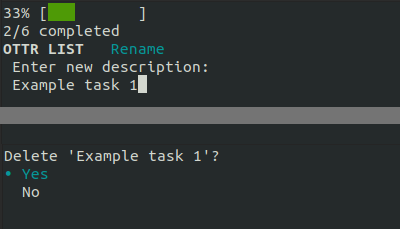
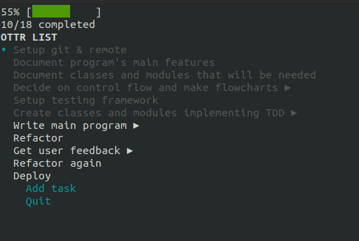

# ottr

ottr repo: https://github.com/smith-sj/ottr

## Overview
Organisational Task Tracker (ottr) is a repository-specifc terminal app for keeping track of tasks associated with a specific project. 
Once initialized inside of a repo, users can add, remove, re-organize, and nest tasks, either striaght from the command line or by launching
the ottr user interface. ottr was designed with flexible workflows in mind, so everything that can be done from ottr's UI can also be achieved
through command line arguments.

## Set-up & Installation

These installation instructions assume you are using a UNIX-like system with Ruby installed.

### Running the script

The following instructions will allow you to run the script without proper installation;
this is okay for testing ottr out, but won't allow you to run it from other directories.

1. clone the ottr repo
1. open terminal
1. `cd` into the `ottr/src` directory containing `ottr`
1. run `./installer.sh`
1. initialize ottr by running `./ottr init`

Now that ottr is initalized you can run the script using the command `./ottr` from the current working directory 

### Installing ottr

The following instructions are a bit more involved but will allow you to use ottr from any directory, 
the way it was intended to be run.

1. clone the ottr repo
1. open terminal
1. run `echo $PATH` to see a list of directories. You will need to choose one for installing ottr, traditionally it's best to use `/usr/local/bin/`
1. if you would like to use `/usr/local/bin/` but it doesn't exist, create it using `mkdir -p /usr/local/bin`
1. `cd` into the `ottr/src` directory containing `ottr`
1. run `./installer.sh` to install required ruby gems
1. create a softlink by running `sudo ln -s $PWD/ottr /usr/local/bin/` (or use the path you chose in step 3)

If the link was successful you should be able to initiate ottr in any directory by `cd`ing into it and running `ottr init`. Ottr can then be used in that directory by running `ottr`.

## How to use ottr

The easiest way to learn how to use ottr is to jump into the UI and play around with it.

To initiate ottr in any directory, simply `cd` into that directory and run `ottr init`. The ottr UI can now be accessed from that directory using the `ottr` command. We'll cover how to use the UI later, but for now lets look at what else you can do from the command line.

### Ottr from the command line

* `ottr init` initiates ottr in the current working directory
* `ottr add "just an example"` will add a new task called *just an example*
* `ottr add 1 "a nested example"` will add a new child-task called *a nested example* to the task in position 1
* `ottr log` prints a list of all tasks and child-tasks

*e.g. running the previous **add** commands and then running the **log** command would return:*
```
1. just an example
    1.1. a nested example
```

* `ottr comp 2` will close the **2nd** task, marking it as complete
* `ottr comp 6 1` will close the **1st** child-task of the **6th** task
* `ottr open 2` will re-open the **2nd** task, marking it as incomplete
* `ottr open 6 1` will re-open the **1st** child-task of the **6th** task, marking it as incomplete  

*note: parent-tasks can only be closed by completing their child-tasks, similarily they may only be re-opened by re-opening one of their child-tasks. Adding a new child-task to a closed parent-task will re-open it; deleting an open child-task will close it's parent-task, if the remaining child-tasks are closed.*

* `ottr move 3` will open a menu for moving the **3rd** task
* `ottr move 3 2` will open a menu for moving the **2nd** child-task of the **3rd** task
* `ottr del 2` will delete the **2nd** task (you will be asked to confirm the deletion)
* `ottr del 5 3` will delete the **3rd** child-task of the **5th** task (you will be asked to confirm the deletion)
* `ottr name 3` will open a menu to rename the **3rd** task
* `ottr name 2 6` will open a menu to rename the **6th** child-task of the **2nd** task

* `ottr wipe` will wipe the entire list (you will be asked to confirm the wipe)

### Using the ottr UI

`cd` into the directory where ottr has been inititalized

the ottr UI can be accessed by running `ottr`

*A newly initialized list will look like this:*



Navigate the menu using ↑/↓ and press enter to select your option.

Use the `Add task` option to add some task.

*With a few tasks added the list will look like this:*



Select one of the tasks and press enter

This will open a sub-menu for that task with a list of options

*The sub-menu for a task looks like this:*



Add a child-task to the selected task by selecting the `Add Task` option from the sub-menu.

A prompt will appear asking for a new name or the child-task.

If you wish to **cancel the new task**, simply **leave the field blank**, otherwise enter a name or description for your task.



After adding a few child-tasks, the child tasks will fill up the sub-menu.

The parent-task's options will still be reachable below the child-tasks.

*The task's sub-menu will now look like this:*



*Selecting a child-task will open another sub-menu for that child-task:*



Start ticking off some of some of the tasks by selecting the `Complete` option.

Once all of a task's child-tasks have been completed, it will become complete.

Complete tasks are displayed in dark grey.

*The 3 child tasks have been completed, so the parent is greyed out and the progress bar shows that 50% of the tasks are complete:*



*note: parent-tasks can only be closed by completing their child-tasks, similarily they may only be re-opened by re-opening one of their child-tasks. Adding a new child-task to a closed parent-task will re-open it; deleting an open child-task will close it's parent-task, if the remaining child-tasks are closed.*

Regular tasks, parent-tasks and child-tasks can all be moved using the `move` option.

When the `move option` is selected, a menu will appear, with the selected task blinking.

Select the new position of the task by using ↑/↓ and pressing **enter**.



Regular tasks, parent-tasks and child-tasks can all be renamed and deleted.

Both the `rename` and `delete` options, will bring up their respective prompts.



A more mature list may look something like this:




## Style Guide

Ottr was created with ***The Ruby Style Guide*** by *Alex J. Murphy* in mind. The style guide contains best practices to help Ruby programmers write code that can be easily interpreted and maintained by other programmers. It was based off suggestions and feed back from the Ruby community as well as recources such as [***Programming Ruby***](https://pragprog.com/titles/ruby4/programming-ruby-1-9-2-0-4th-edition/) and [***The Ruby Programming Language***](https://www.amazon.com/Ruby-Programming-Language-David-Flanagan/dp/0596516177)

*source: https://github.com/rubocop/ruby-style-guide*

Thanks to Murphy's code analyrzer and formatter, [***Rubocop***](https://github.com/rubocop/rubocop); following this style guide was easy. The formatter picked up most of my style violations and properly corrected them.

*source: https://github.com/rubocop/rubocop*

## Features

### TASKS

The entire ottr application revolves around creating and organizing a list of tasks. The tasks themselves must have a collection of actions that can be performed on them. 

Tasks will need to have different states; whether or not a task has been completed will decided whether it is in a ***complete*** or ***incomplete*** state; whether or not the task contains child-tasks will decide whether the task is in a ***parental*** or ***non-parental*** state. Depending on a task's state, it will have a different set of actions, or ***default options*** that can be performed on it.

For example, here is a list of different states a task may be in, folowed by a list of default options that the task will have:

- **Non-parental, incomplete task**: *Complete, Rename, Move, Add Child-Task, Delete*
- **Parental, complete task**: *Rename, Move, Add Child-Task, Delete*

and so on...

### CHILD-TASKS

A child-task is a task nested inside of another task. This feature will allow users to break down bigger tasks into smaller steps. Like regular tasks, child tasks will have complete or in-complete states, however they will not be able to nest other tasks, and so do not have a parental state.

Child-tasks should have most of the same functionality as regular tasks depending on their state (*Complete, Rename, Move, Delete*).

### MENU

The main menu will contain a list of the **top level tasks** as well as the option to **add a new task** or **quit the program**. The tasks should be visibly different to the default options, as to avoid confusion, and it should be clear where the pointer is positioned.

### SUB-MENUS

Sub-menus will pop up when a task or child-task is selected. They should show all of the child-tasks and default options associated with that task or child-task, but they should also display a greyed out view of the rest of the list, so that the user still has context as to where the sub-menu is popping up.

### PROGRESS BAR

This feature should be a quick and easy way for the user to get an idea of how far through the project they are. The progress bar will be visible from both the main menu and sub-menu views, it will always display a visual representation of the **completed percentage** of all tasks. It should also indicate the fraction of completed tasks / total tasks.

### DEFAULT OPTIONS

- ***Add Task***
- ***Complete Task***
- ***Rename***
- ***Move***
- ***Delete***


### COMMAND LINE ARGUMENTS HANDLER

