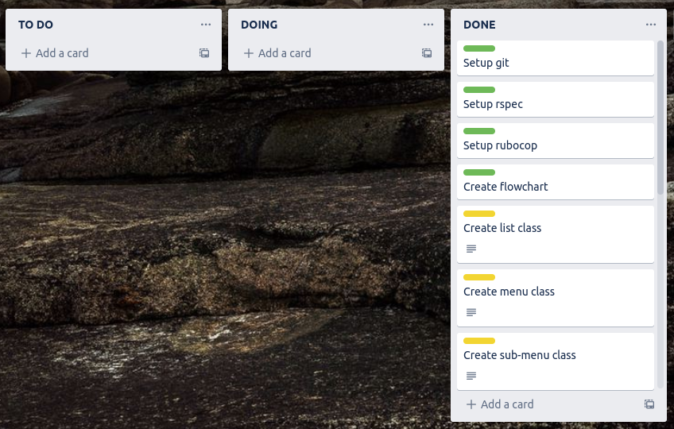

# ottr

ottr repo: https://github.com/smith-sj/ottr

## Table of Contents

### ottr Documentation
- [Overview](#overview)
- [Set-up & Installation](#setup)
- [How to Use Ottr](#howto)

### Assignment-specific documentation
- [Style Guide](#styleguide)
- [Features](#features)
- [Implementaion Plan](#plan)
- [Trello](#trello)
- [Testing Procedure](#testing)
- [Flowcharts](#flow)

## <a name="overview"></a>Overview
Organisational Task Tracker (ottr) is a repository-specific terminal app for keeping track of tasks associated with a specific project. 
Once initialized inside of a repo, users can add, remove, re-organize, and nest tasks, either straight from the command line or by launching
the ottr user interface. ottr was designed with flexible workflows in mind, so everything that can be done from ottr's UI can also be achieved
through command line arguments.

## <a name="setup"></a>Set-up & Installation

These installation instructions assume you are using a UNIX-like system with Ruby installed.

### Running the script

The following instructions will allow you to run the script without proper installation;
this is okay for testing ottr out, but won't allow you to run it from other directories.

1. clone the ottr repo
1. open terminal
1. `cd` into the `ottr/src` directory containing `ottr`
1. run `./installer.sh`
1. initialize ottr by running `./ottr init`

Now that ottr is initialized you can run the script using the command `./ottr` from the current working directory 

### Installing ottr

The following instructions are a bit more involved but will allow you to use ottr from any directory, 
the way it was intended to be run.

1. clone the ottr repo
1. open terminal
1. run `echo $PATH` to see a list of directories. You will need to choose one for installing ottr, traditionally it's best to use `/usr/local/bin/`
1. if you would like to use `/usr/local/bin/` but it doesn't exist, create it using `mkdir -p /usr/local/bin`
1. `cd` into the `ottr/src` directory containing `ottr`
1. run `./installer.sh` to install required ruby gems
1. create a softlink by running `sudo ln -s $PWD/ottr /usr/local/bin/` (or use the path you chose in step 3)

If the link was successful you should be able to initiate ottr in any directory by `cd`ing into it and running `ottr init`. Ottr can then be used in that directory by running `ottr`.

## <a name="howto"></a>How to use ottr

The easiest way to learn how to use ottr is to jump into the UI and play around with it.

To initiate ottr in any directory, simply `cd` into that directory and run `ottr init`. The ottr UI can now be accessed from that directory using the `ottr` command. We'll cover how to use the UI later, but for now lets look at what else you can do from the command line.

### Ottr from the command line

* `ottr init` initiates ottr in the current working directory
* `ottr add "just an example"` will add a new task called *just an example*
* `ottr add 1 "a nested example"` will add a new child-task called *a nested example* to the task in position 1
* `ottr log` prints a list of all tasks and child-tasks

*e.g. running the previous **add** commands and then running the **log** command would return:*
```
1. just an example
    1.1. a nested example
```

* `ottr comp 2` will close the **2nd** task, marking it as complete
* `ottr comp 6 1` will close the **1st** child-task of the **6th** task
* `ottr open 2` will re-open the **2nd** task, marking it as incomplete
* `ottr open 6 1` will re-open the **1st** child-task of the **6th** task, marking it as incomplete  

*note: parent-tasks can only be closed by completing their child-tasks, similarly they may only be re-opened by re-opening one of their child-tasks. Adding a new child-task to a closed parent-task will re-open it; deleting an open child-task will close it's parent-task, if the remaining child-tasks are closed.*

* `ottr move 3` will open a menu for moving the **3rd** task
* `ottr move 3 2` will open a menu for moving the **2nd** child-task of the **3rd** task
* `ottr del 2` will delete the **2nd** task (you will be asked to confirm the deletion)
* `ottr del 5 3` will delete the **3rd** child-task of the **5th** task (you will be asked to confirm the deletion)
* `ottr name 3` will open a menu to rename the **3rd** task
* `ottr name 2 6` will open a menu to rename the **6th** child-task of the **2nd** task

* `ottr wipe` will wipe the entire list (you will be asked to confirm the wipe)

### Using the ottr UI

`cd` into the directory where ottr has been initialized

the ottr UI can be accessed by running `ottr`

*A newly initialized list will look like this:*


Navigate the menu using ↑/↓ and press enter to select your option.

Use the `Add task` option to add some task.

*With a few tasks added the list will look like this:*


Select one of the tasks and press enter

This will open a sub-menu for that task with a list of options

*The sub-menu for a task looks like this:*


Add a child-task to the selected task by selecting the `Add Task` option from the sub-menu.

A prompt will appear asking for a new name or the child-task.

If you wish to **cancel the new task**, simply **leave the field blank**, otherwise enter a name or description for your task.


After adding a few child-tasks, the child tasks will fill up the sub-menu.

The parent-task's options will still be reachable below the child-tasks.

*The task's sub-menu will now look like this:*


*Selecting a child-task will open another sub-menu for that child-task:*


Start ticking off some of some of the tasks by selecting the `Complete` option.

Once all of a task's child-tasks have been completed, it will become complete.

Complete tasks are displayed in dark grey.

*The 3 child tasks have been completed, so the parent is greyed out and the progress bar shows that 50% of the tasks are complete:*


*note: parent-tasks can only be closed by completing their child-tasks, similarly they may only be re-opened by re-opening one of their child-tasks. Adding a new child-task to a closed parent-task will re-open it; deleting an open child-task will close it's parent-task, if the remaining child-tasks are closed.*

Regular tasks, parent-tasks and child-tasks can all be moved using the `move` option.

When the `move option` is selected, a menu will appear, with the selected task blinking.

Select the new position of the task by using ↑/↓ and pressing **enter**.


Regular tasks, parent-tasks and child-tasks can all be renamed and deleted.

Both the `rename` and `delete` options, will bring up their respective prompts.


A more mature list may look something like this:


## <a name="styleguide"></a>Style Guide

Ottr was created with ***The Ruby Style Guide*** by *Alex J. Murphy* in mind. The style guide contains best practices to help Ruby programmers write code that can be easily interpreted and maintained by other programmers. It was based off suggestions and feed back from the Ruby community as well as resources such as [***Programming Ruby***](https://pragprog.com/titles/ruby4/programming-ruby-1-9-2-0-4th-edition/) and [***The Ruby Programming Language***](https://www.amazon.com/Ruby-Programming-Language-David-Flanagan/dp/0596516177)

*source: https://github.com/rubocop/ruby-style-guide*

Thanks to Murphy's code analyzer and formatter, [***Rubocop***](https://github.com/rubocop/rubocop); following this style guide was easy. The formatter picked up most of my style violations and properly corrected them.

*source: https://github.com/rubocop/rubocop*

## <a name="features"></a>Features

### Tasks

The entire ottr application revolves around creating and organizing a list of tasks. The tasks themselves must have a collection of actions that can be performed on them. 

Tasks will need to have different states; whether or not a task has been completed will decided whether it is in a ***complete*** or ***incomplete*** state; whether or not the task contains child-tasks will decide whether the task is in a ***parental*** or ***non-parental*** state. Depending on a task's state, it will have a different set of actions, or ***default options*** that can be performed on it.

For example, here is a list of different states a task may be in, followed by a list of default options that the task will have:

- **Non-parental, incomplete task**: *Complete, Rename, Move, Add Child-Task, Delete*
- **Parental, complete task**: *Rename, Move, Add Child-Task, Delete*

and so on...

Another important aspect to note is that each task should have a ***unique ID***, that can be referenced when performing actions on them. This will mean we don't have to worry about errors relating to task names when performing methods on tasks. It also means that there is less validation required for task names, as long as it contains a character of some form and even if it shares the same name as another task, it will be valid.

### Child-tasks

A child-task is a task nested inside of another task. This feature will allow users to break down bigger tasks into smaller steps. Like regular tasks, child tasks will have complete or in-complete states, however they will not be able to nest other tasks, and so do not have a parental state.

Child-tasks should have most of the same functionality as regular tasks depending on their state (*Complete, Rename, Move, Delete*).

### Menu

The main menu will contain a list of the **top level tasks** as well as the option to **add a new task** or **quit the program**. The tasks should be visibly different to the default options, as to avoid confusion, and it should be clear where the pointer is positioned.

### Sub-menus

Sub-menus will pop up when a task or child-task is selected. They should show all of the child-tasks and default options associated with that task or child-task, but they should also display a greyed out view of the rest of the list, so that the user still has context as to where the sub-menu is popping up.

### Progress Bar

This feature will provide a quick and easy way for the user to get an idea of how far through the project they are. The progress bar will be visible from both the main menu and sub-menu views, it will always display a visual representation of the **completed percentage** of all tasks. It should also indicate the fraction of completed tasks / total tasks.

### Default Options

The following options are considered a main feature of the program, as they will be what gives ottr its organizational qualities. Each option may behave slightly different between states and task types, but will perform the following actions:

- ***Add Task***: Add a task to the main menu or a child-task to a parent-task's sub-menu
- ***Complete***: Mark a task or child-task as complete
- ***Re-open***: Mark a completed task or child-task as incomplete
- ***Rename***: Rename a task or child-task
- ***Move***: Move task or child-task to a different position in its list
- ***Delete***: Delete a task from its list


### Command Line Arguments Handler

This feature will ensure everything that can be done from the ottr UI, will be achievable through command line arguments.

For example, instead of launching ottr and selecting **Add Task** the user should be able to run a command directly from the directory such as `ottr add "name of task"`.

All commands from the **DEFAULT OPTIONS** section should be included in this feature as well as:

- `ottr init` for initiating ottr in the directory
- `ottr help` for displaying a list of commands
- `ottr log` for printing the task list to the terminal
- `ottr wipe` for wiping the entire task list

In order to target specific tasks in the list, a numbering system will be implemented. When `ottr log` is run, the program should return something along the lines of:

```
1. Example of a task
    1.1. Example of a child task
    1.2. Another child task
    1.3. Another example of a child task
2. Another example of a task
3. One more example of a task
```

The user should be able to access a main task by referencing its position in the list. `ottr del 2`, for example, should delete the 2nd task, labeled *'Another example of a task'*. Whereas something like `ottr del 1 3` should delete the 3rd child-task of the 1st task, labeled *'Another example of a child task'*.

Some command line arguments like `ottr move` or `ottr rename` may require an extra prompt in the terminal for more user input or confirmation.

Finally the command line handler should always print some form of feedback, to let the user know that their command worked, or didn't work.

## <a name="plan"></a>Implementation Plan

### ***Total estimated time:*** *58 hours 15 mins*

### List Class

#### **Estimated Time:** *10 hours*
#### **Priority:** *High*

#### **Checklist:**

- brainstorm the design of the class *(1 hr)*
- Make the class and the initialize method *(1 hr)*
- Write each method for the class *(3 hrs)*
    - add task
    - delete task
    - move task
    - complete task
    - reopen task
    - select task
    - deselect task
- write tests for the class *(3 hrs)*
- refactor class *(2 hrs)*

#### **Outline:**

In order to implement the tasks and child-tasks features, I'v decided to create a list class. My initial thoughts were to create classes for both types of tasks. However, when considering the overall architecture of my program, and the classes needed in order to implement the other features, I decided to instead create a single ***List class***. ***List instances*** can be created, that contain an ***instance variable*** called ***@tasks*** which initiates as an empty array. This ***@tasks array*** will be store tasks as ***hashes***, and each hash may contain another array of child-tasks, also represented as hashes.

*Using the previous example, the **@tasks** array may look something like this:*

```
[
    {
    'id' => 2
    'description' => "Example of a task",
    'is_complete?' => false,
    'is_parent?' => false,
    'is_selected?' => false,
    'child_tasks' => []
    },
    {
    'id' => 2
    'description' => "Another example of a task",
    'is_complete?' => false,
    'is_parent?' => true,
    'is_selected?' => false,
    'child_tasks' => [{
                        'id' => 4
                        'description' => "Example of a child task",
                        'is_complete?' => false,
                        'is_selected?' => false,
                        },
                        {
                        'id' => 5
                        'description' => "Another child task",
                        'is_complete?' => false,
                        'is_selected?' => false,
                        },
                        {
                        'id' => 6
                        'description' => "Another example of a child task",
                        'is_complete?' => false,
                        'is_selected?' => false,
                        },]
    },
    {
    'id' => 3
    'description' => "One more example of a task",
    'is_complete?' => false,
    'is_parent?' => false,
    'is_selected?' => false,
    'child_tasks' => []
    }
]
```

Using this structure the ***list instance*** will have full knowledge of all tasks, child-tasks as well as their states and any other data relating to them, such as their unique ID.

The list class will also contain all of the methods needed for altering the list. This shouldn't be too hard because a list can be accessed like this `@tasks[i]` where `i` is the list's position. From there it is just a matter of writing methods for editing the list, most of which will just be methods of the **Array class**, such as `@tasks.delete_at(selected_task)`. Renaming a task might look something like this `@tasks['selected_task']['description'] = 'new description'`.

Accessing child-tasks will be slightly more challenging, but as long as we know which task has been selected, as well as which of its child-tasks has been selected we can access it like this `@tasks[selected_task]['child_tasks]['selected_child']`. So renaming a child task might look something like this `@tasks[selected_task]['child_tasks]['selected_child']['description'] = 'new description'`


### JSON Handler Module

#### **Estimated Time:** *2 hours 45 mins*
#### **Priority:** *High*

#### **Checklist:**

- brainstorm the design of the module *(1 hr)*
- Write load json method *(15 mins)*
- Write save json method *(15 mins)*
- Write parse json method *(15 mins)*
- write tests for the module *(1 hr)*

#### **Outline:**

Any changes to tasks will be made via the **List instance**, which as previously discussed, happens by updating an **instance variable** called **@tasks**. After each change to **@tasks**, the entire array can be written to a **json file** (over-writing any previous data), so if the user quits the app and loads it back up again, the **array** stored in the **json file** can be loaded back into the **@tasks** variable of the new **List instance**.

This loading and writing cycle will be handled by a **JSON Handler** module. It will also include methods for parsing the information from **json format** to a **ruby array** and vice versa.

### Menu Class

#### **Estimated Time:** *12 hours*
#### **Priority:** *High*

#### **Checklist:**

- brainstorm the design of the class *(1 hr)*
- learn how to use TTY prompt and Colorize *(1 hr)*
- Make the class and the initialize method *(1 hr)*
- Write each method for the class *(4 hrs)*
- write tests for the class *(3 hrs)*
- refactor the class * (2 hrs)

#### **Outline:**

Now that a strategy for storing the tasks has been developed. A process for displaying the list, and interacting with it needs to be developed.

The **Menu Class** will take the **@tasks** array from the current **List instance** and populate a **menu** with the top level tasks. The **default options** will also be appended to this list of items, producing a menu that contains all of the tasks, as well as the default options for the main menu.

The menu will implement using the [**TTY-prompt**](https://github.com/piotrmurach/tty-prompt) gem by [**Piotr Murach**](https://github.com/piotrmurach).

The `.select()` method from ***TTY-prompt*** shows a menu populated with choices that can be fed in as an array of **strings** or **hashes**. We'll feed it an **array of hashes**, where the **key** of each hash represents what will be shown in the menu and the **value** contains the value that is returned when the user makes their selection. In our case the **key** will be each task's name and the **value** will be each task's **unique id**.

With the `.select()` method in mind, all we need to is take the returned value (which will always be a task id) and create a method that assigns it to a `selected_task` variable, which can be used in the **List Class** methods.

The **default options** will be stored in the same menu, but the hash's **key** will contain the name of the option (e.g. `Delete`) and the **value** will contain a symbol like **:DELETE**.

Now we know that if a menu returns an instance of **Integer**, then the user selected a **task**, but if the menu returns a symbol, the user selected a **default option**. If a task was selected then a sub-menu can be loaded for that task, whereas if a default option was selected, the appropriate action can be performed.

Each time the ottr UI is initiated, a **Menu Instance** will be initiated. This instance contains **instance variables** with different combinations of default options that can be loaded into each menu, depending on the surrounding factors. (Sometimes we may need to load different default options). The current set of ***default options*** in use can be loaded into an ***options*** hash which will be used when constructing the menu.

The ***Menu Class*** will need to contain methods for initiating the menu object, populating it with tasks + default options, and constructing the actual menu itself.

Finally the menu class will also have to utilize the [**Colorize**](https://github.com/fazibear/colorize) gem by [***Michał Kalbarczyk***](https://github.com/fazibear) for coloring completed tasks as dark-grey and coloring default options as a different color to tasks.


### Sub-Menu Class

#### **Estimated Time:** *9 hours*
#### **Priority:** *High*

#### **Checklist:**

- brainstorm the design of the class *(1 hr)*
- Make the class and the initialize method *(1 hr)*
- Write each *populater* method for the class *(3 hrs)*
- create a move task menu *(15 mins)*
- create a move child-task menu *(15 mins)*
- create minimal menus for the argv prompts *(15 mins)*
- create an 'are you sure' prompt *(15 mins)*
- write tests for the class *(3 hrs)*


#### **Outline:**

The ***Sub-Menu Class*** will inherit the **Menu Class**, but will also include its own unique characteristics.

An instance of the sub-menu class will be loaded when the app is run, but it will be populated with different ***default options*** depending on the context in which it is called.

The main difference between the **Menu** and **Sub-menu** classes, is that sub-menus will be built inside the main menu. These ***lower level*** menus can be used for displaying actions for particular tasks, showing actions for child-tasks or for moving a task from one position to another.

I could implement this so that a **new object** is created for each **sub-menu**, although I think it will be better to mirror what the **Menu class** does, and have a single **Sub-menu instance** that can load in different **default options** for different scenarios. I may need to include specific methods for constructing one-off menus, such as for moving tasks from one position to another.

Much like the main menus, the sub-menu's will return **unique ID's** for tasks, and symbols for **default options**.

### Process ARGV Module

#### **Estimated Time:** *11 hours*
#### **Priority:** *Medium*

#### **Checklist**

- brainstorm the design of the module *(1 hr)*
- write the control flow logic for determining methods *(3 hrs)*
- incorporate methods from the List class into the control flow *(3 hrs)*
- write methods for giving user feedback and loading sub-menus *(1 hr)*
- write tests for the module *(3 hrs)*

#### **Outline:**

This module will be used for handling command line arguments. As previously mentioned, all the methods that can be accessed inside the UI should also be achievable from the command line.

For this to work we will simply pass the module the **ARGV** array where a control flow will decide what methods to perform based on the contents of the array.

When running `ottr`, the module will check whether it has been **initialized**. If it has it will run the program, otherwise it will let the user know that `'ottr has not been initialized'`

The module will need to include a method for initializing ottr. When the user runs `ottr init`, it should check whether a hidden file called `.ottr.json` exists in the current working directory. If it does it will return `'ottr already initialized'` but if it doesn't, it will call on the **JSON Handler** module to create the json file.

Because the ***List Class*** contains all of the methods we need to interact with the array inside **json file**, it should be as easy as initiating a new instance of the **List Class** and using its methods to perform the various actions. A sub-menu may also be needed to make confirmations and name changes etc.

### Create Main Loop

#### **Estimated Time:** *11 hours*
#### **Priority:** *High*

#### **Checklist**

- brainstorm the design of the main loop *(1 hr)*
- write the control flow logic for the main program *(3 hrs)*
- incorporate methods from the List, Menu and Sub-Menu classes into the control flow *(4 hrs)*
- incorporate the Process ARGV module into the start of the program *(2 hour)*
- identify points in the control flow where load/save, select/deselect methods should take place (think about unexpected quitting) *(1 hour)*

#### **Outline:**

The main loop for the program will be a control flow statement, it will implement all of the class and modules to facilitate the user's input and return output. 

The control flow will keep looping back to the main menu, and the load/save & select/deselect methods will have to be strategically placed so that any unexpected termination of the program will not effect the performance of the app. *(e.g. all tasks must be deselected as soon as the program runs, in case it quit unexpectedly the last time and a task was still in a selected state.)*

### Create Progress Bar

#### **Estimated Time:** *2 hours 30 mins*
#### **Priority:** *Low*

#### **Checklist**

- brainstorm the design of the Progress Bar *(30mins)*
- learn how to use TTY-progress bar *(15mins)*
- create Progress Bar class *(15 mins)*
- write method for calculating how many tasks have been completed *(30 mins)*
- implement Progress Bar into other classes *(1 hour)*

#### **Outline:**

The main loop for the program will be a control flow statement, it will implement all of the class and modules to facilitate the user's input and return output. 

The control flow will keep looping back to the main menu, and the load/save & select/deselect methods will have to be strategically placed so that any unexpected termination of the program will not effect the performance of the app. *(e.g. all tasks must be deselected as soon as the program runs, in case it quit unexpectedly the last time and a task was still in a selected state.)*

## <a name="trello"></a>Trello Board

The trello board used during this project can be found [here](https://trello.com/invite/b/IUxAVH0w/2994084c7a723e0f590819e1a02e32b0/ottr)



## <a name="testing"></a>Testing Procedure

When beginning this project, my aim was to use **TDD** for the entire development process. A few tests in, however, I realised how difficult this would be - especially with my reliance on loading external json files. I researched a little bit into using mock files, but after getting more confused, and then consulting my educator; I decided it would be best to abstract out as much of the external file handling logic as possible to separate methods and test whatever was left.

Even with this minimal testing approach, being new to testing in general really slowed me down. In order to get this project over the finish line in time, I decided to abandon the TDD approach, and rely on a few simple tests to tell me if the core logic of my program was working.

I acknowledge that in the long run, not using TDD would have created more debugging time; however, to an inexperienced tester, using the TDD approach may have stopped me from getting this project finished in time. I want to go back and implement more tests as I develop this program in the future, and on the next project will try to implement a TDD approach for the entire development process.

My core tests included 13 tests in the **list class** and **Process ARGV Module**

The **List** tests included 9 tests in 2 different contexts, and ensured that:

**given a task list:**
- task lists were being passed to menus correctly
- tasks' unique id's were being generated and returned correctly
- new tasks were being added to the task list

**given a task list with a selected task:**
- selected tasks were returning the correct id's
- selected tasks were being unselected properly
- unselected tasks could be selected properly

The **Process ARGV** included 4 tests, and ensured that:

**given a list and task index:**
- the argv processor could find whether a specific task index existed
- the argv processor could find whether a specific child task existed in a parent task

Although these tests were simple, they helped to give me valuable feedback when refactoring the application. A quick run of `rspec` confirmed that the fundamental list logic was still working, that lists were being provided to menus, and that the argv processor was accessing tasks correctly.

## <a name="flow"></a>Flow Charts

### General Flowchart


### Detailed Flowchart

